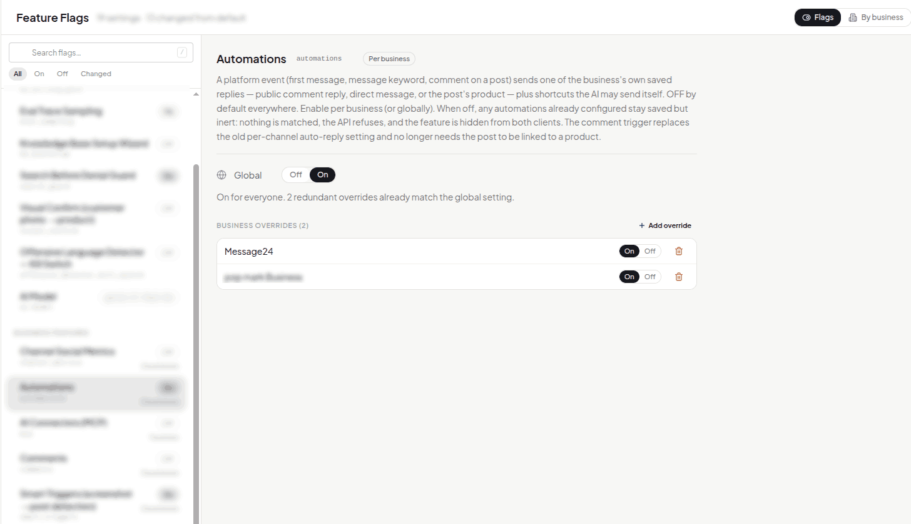

In April I had to record a screen video for Meta's app review (a huge pain, to be honest). The feature I was showing needed a permission Meta hadn't granted yet, so I couldn't turn it on for everyone. Recording it locally wasn't realistic either, because most of it depends on real webhooks. So I added a feature flag: the feature stayed off in production except on the one business I was recording.

That was the first flag. Since then, I use one whenever I want to move fast without customers paying for it:

- Recording a review video for a Meta feature we don't have permission for yet.
- Trying a feature on my own business before anyone else sees it. I run Message24's social media on Message24, so I'm usually the first customer of anything I build. This has been very useful in getting the UX right.
- Trying a different AI model without changing anything for real customers.
- Shipping a risky change with a switch I can flip without a redeploy if it goes wrong.

A flag is checked everywhere the feature lives: the API, background jobs, the AI agent and the app.

This is the admin page for flags. Automations is on for everyone now, and the two business overrides underneath are left over from when it was on for only those two businesses:



To keep thing simple, there's no flag service. Flags are rows in a key-value table in PostgreSQL:

```sql
CREATE TABLE feature_flags (
    key         TEXT PRIMARY KEY,   -- "automations" or "automations:<business id>"
    value       TEXT NOT NULL,      -- "on", "off", "0.1", a model name...
    description TEXT,
    updated_at  TIMESTAMPTZ DEFAULT NOW()
);
```

To decide whether a feature is on, I check from most specific to least:

1. An override for this business or channel
2. The global value
3. The default in code, which is almost always "off"

An override can go either way. A feature can be on for everyone except one business, or off for everyone except one.

If reading the override fails, the answer is off. It doesn't fall back to the global value. The override is often what keeps a business out of a rollout, and a database hiccup shouldn't let it in.

Flags can have different values:

- **On/off**, for most things.
- **A rate between 0 and 1**, for things like sampling 10% of AI replies to evaluate.
- **Enum**, for trying out different models without affecting customers.

Feature flags have allowed me to decouple physical deployments from delivering changes to to production. It also allows me to merge PRs much faster and make them smaller.