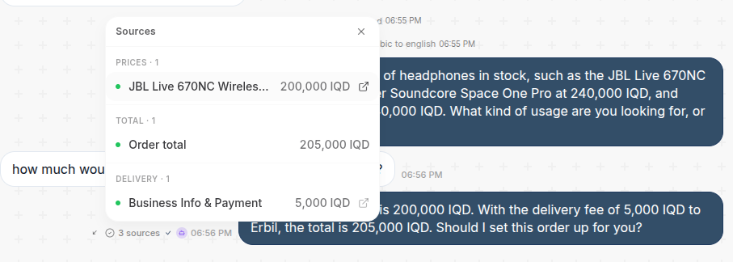

While working on [Message24](https://message24.net) one of the biggest issues my customers were facing was hallucination. [Some] LLMs find it really hard to say "I don't know" (or in our case, escalate the conversation). Instead, they prefer to be useful idiots and just make things up.

In my experience, hallucination mostly happens in cases where the agent doesn't have enough context: the product the customer is asking for doesn't exist, or is out of stock, etc... In a bid to make the customer happy (LLMs are like golden retrievers), it will lie and make stuff up!

While you can try to threaten or beg the LLM to not make things up, prompt engineering only takes you so far. To make LLMs useful in real world applications, you need a set of deterministic guardrails and tools in the agent harness.

I want to talk about two ways that have been very effective in our case:

**1. Structured Function Calls (Tools)**

Instead of getting the LLM's response in free-form text, force it to use a `reply` tool. This prevents the cases where the agent just blurts out nonsense (e.g. vomiting out its thinking state) or cuts its response mid-sentence.

**2. Citations**

One really effective method that has dramatically improved hallucination rate (for cases where the agent should say "I don't know" but makes stuff up instead) is Citations. The idea is simple: for each claim the agent makes, you ask the agent to provide a citation.

In our case, for every price the agent quotes, it needs to give us the source of the price: either from Product Catalog or from the Knowledge Base. And then we validate the citations where possible and block the response if we couldn't validate the claims.

We took it one step further: we have a simple regex filter that checks all price-looking numbers and will ask the LLM for citations if it hasn't provided one for it already.

This is how we show the citations back to the business in the UI:
